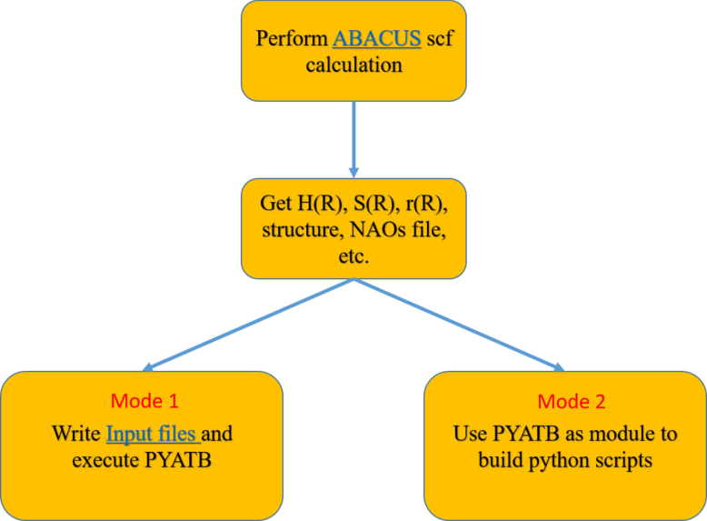

- [1. Introduction](#1-introduction)
  - [1.1 Methodology](#11-methodology)
  - [1.2 Capabilities](#12-capabilities)
  - [1.3 Workflow](#13-workflow)
- [2. Installation](#2-installation)
  - [2.1 Download](#21-download)
  - [2.2 Prerequisites](#22-prerequisites)
  - [2.3 Install](#23-install)
- [3. Run](#3-run)
- [4. Brief introduction of the input files](#4-brief-introduction-of-the-input-files)
  - [4.1 Input](#41-input)
  - [4.2 HR, SR, rR](#42-hr-sr-rr)
  - [4.3 Other file](#43-other-file)
- [5. FUNCTIONS](#5-functions)
  - [5.1 BAND_STRUCTURE](#51-band_structure)
  - [5.2 BANDUNFOLDING](#52-bandunfolding)
  - [5.3 FAT_BAND](#53-fat_band)
  - [5.4 FERMI_ENERGY](#54-fermi_energy)
  - [5.5 FERMI_SURFACE](#55-fermi_surface)
  - [5.6 FIND_NODES](#56-find_nodes)
  - [5.7 JDOS](#57-jdos)
  - [5.8 PDOS](#58-pdos)
  - [5.9 SPIN_TEXTURE](#59-spin_texture)
  - [5.10 AHC](#510-ahc)
  - [5.11 BERRY_CURVATURE](#511-berry_curvature)
  - [5.12 CHERN_NUMBER](#512-chern_number)
  - [5.13 OPTICAL_CONDUCTIVITY](#513-optical_conductivity)
  - [5.14 POLARIZATION](#514-polarization)
  - [5.15 WILSON_LOOP](#515-wilson_loop)
- [6. Detailed introduction of the Input file](#6-detailed-introduction-of-the-input-file)
  - [6.1 Full List of INPUT Keywords](#61-full-list-of-input-keywords)
  - [6.2 Setting of k points](#62-setting-of-k-points)
  - [6.3 Setting of integration](#63-setting-of-integration)


# 1. Introduction

PYATB, Python ab initio tight binding simuation package, a python package for computing electronic structures and related properties based on the ab initio tight binding Hamiltonian.

PYATB is an open-source software package under the GPLv3.0.

Typical applications include calculation of band structure, density of states, projected density of states, Fermi energy, Fermi surface, etc.

PYATB can be used to calculate the energy band spectrum function obtained by projecting the supercell wave function on the relevant k points of the primitive cell through the band unfolding method, which can be directly compared with the ARPES result. 

PYATB can also be used to calculate Wilson loop and Berry curvature, which can simply classify topological phase, and study the properties of topological non-trivial materials such as topological insulators and Weyl/Dirac semimetals. 

Furthermore, PYATB provides calculations of optical properties of solid materials, including linear optical response and nonlinear optical response, such as optical conductivity, shift current, Berry curvature dipole, etc.

The PYATB Developer Group includes Lixin He, Gan jin, Hongsheng Pang, Yuyang Ji, Zujian Dai.

## 1.1 Methodology

PYATB works in the tight binding framework, and the tight binding parameters are obtained from first principles software based on the atomic orbital bases, such as [ABACUS](https://abacus.ustc.edu.cn/).

Note: ABACUS (Atomic-orbital Based Ab-initio Computation at UStc) is an open-source package based on density functional theory (DFT). For a detailed introduction, please refer to [https://abacus.ustc.edu.cn/](https://abacus.ustc.edu.cn/).

The periodic system follows Bloch's theorem, and the Schrödinger equation satisfied by a single electron is $H |\Psi_{n\mathbf{k}}\rangle = E_{n\mathbf{k}} |\Psi_{n\mathbf{k}}\rangle$. We expand the wave function of a single electron in the numerical atomic orbitals,
$$
|\Psi_{n\mathbf{k}}\rangle = \frac{1}{\sqrt{N}}\sum_{\mu}C_{n\mu}(\mathbf{k})\sum_{\mathbf{R}}\mathrm{e}^{i\mathbf{k}\cdot\mathbf{R}}|\mathbf{R}\mu\rangle,
$$

where $|\mathbf{R}\mu\rangle$ is the atomic orbital localized at the $\mathbf{R}$ unitcell, $C_{n\mu}(\mathbf{k})$ is the expansion coefficient.

By definition, 
$$
\begin{aligned}
    H_{\nu\mu}(\mathbf{k}) &= \sum_{\mathbf{R}}\mathrm{e}^{i\mathbf{k}\cdot\mathbf{R}}H_{\nu\mu}(\mathbf{R})\, , \\
    S_{\nu\mu}(\mathbf{k}) &= \sum_{\mathbf{R}}\mathrm{e}^{i\mathbf{k}\cdot\mathbf{R}}S_{\nu\mu}(\mathbf{R})\, ,
\end{aligned} $$

where
$$
\begin{aligned}
    H_{\nu\mu}(\mathbf{R}) &= \langle\mathbf{0}\nu|H|\mathbf{R}\mu\rangle\, , \\
    S_{\nu\mu}(\mathbf{R}) &= \langle\mathbf{0}\nu|\mathbf{R}\mu\rangle\, .
\end{aligned}
$$

we can convert the Hamiltonian solution into a general eigenvalue solution problem

$$
H(\mathbf{k})C_n(\mathbf{k}) = E_{n\mathbf{k}}S(\mathbf{k})C_n\, .
$$

When solving for the geometric properties of the bands, we also need the dipole matrix, namely:
$$
\begin{aligned}
    A_{\nu\mu, \alpha}^{R}(\mathbf{k}) &= \sum_{\mathbf{R}} \mathrm{e}^{i\mathbf{k}\cdot\mathbf{R}} r_{\nu\mu, \alpha}(\mathbf{R}) \, , \\
    r_{\nu\mu, \alpha}(\mathbf{R}) &= \langle\mathbf{0}\nu|r_{\alpha}|\mathbf{R}\mu\rangle\, .
\end{aligned}
$$

After obtaining the tight binding parameters $H_{\nu\mu}(\mathbf{R})$, $S_{\nu\mu}(\mathbf{R})$, and $r_{\nu\mu, \alpha}(\mathbf{R})$ from the first principles software, the electronic structure can be calculated using PYATB.

## 1.2 Capabilities

PYATB provides the following functionalities:

- related to energy band
  1. [band structure](#51-band_structure)
  2. [band unfolding](#52-bandunfolding)
  3. [fat band](#53-fat_band)
  4. [fermi energy](#54-fermi_energy)
  5. [fermi surface](#55-fermi_surface)
  6. [find nodes](#56-find_nodes)
  7. [JDOS](#57-jdos)
  8. [PDOS](#58-pdos)
  9. [spin texture](#59-spin_texture)

- related to band geometry
  1. [AHC](#510-ahc)
  2. [Berry curvature](#511-berry_curvature)
  3. [Chern number](#512-chern_number)
  4. [optical conductivity](#513-optical_conductivity)
  5. [polarization](#514-polarization)
  6. [Wilson loop](#515-wilson_loop)

## 1.3 Workflow

The basic workflow of pyatb is as follows. First, you need to perform self-consistent calculations from ABAUCS to obtain $H_{\nu\mu}(\mathbf{R})$, $S_{\nu\mu}(\mathbf{R})$, and $r_{\nu\mu, \alpha}(\mathbf{R})$. In addition, some functions also require crystal structure information and atomic orbital data. After you have obtained these files, you can write an Input file to perform the corresponding function calculation of PYATB, or write a script based on the PYATB module to calculate.



# 2. Installation

## 2.1 Download

The latest version of the PYATB package can be obtained from the github repository:

```shell
git clone https://github.com/jingan-181/pyatb.git
```

## 2.2 Prerequisites

At present, PYATB is running in the Linux system, and the Win system and Mac system have not been tested. In order to use PYATB properly, you need to install the following prerequisites:

- Python 3.7 or newer
- NumPy
- SciPy
- mpi4py
- Matplotlib
- C++ compiler
- Intel MKL 

## 2.3 Install

You can install PYATB with the following simple command:

```shell
python setup.py install --record log
```

In the `setup.py` file you need to modify the **CXX** and **LAPACK_DIR** variables according to your environment. **CXX** is used to specify the C++ compiler (e.g. icpc, note that it is not the mpi version) and **LAPACK_DIR** is used to specify the intel MKL path.

After completing the installation the executable `pyatb` and the corresponding module `pyatb` (which can be called by `import pyatb`) will be added to the Python environment.

The corresponding uninstall operation is to delete the files generated during Python installation. A simple uninstall command is as follows:

```shell
cat log | xargs rm -rf
```

# 3. Run

PYATB supports mixed parallelism of OpenMP and MPI, and you need to determine the number of threads and processes to run depending on the actual configuration of your computer. 

For example, set the number of threads to 2,
```shell
export OMP_NUM_THREADS=2
```
and then use 6 processes to run PYATB,
```shell
mpirun -n 6 pyatb
```


# 4. Brief introduction of the input files

## 4.1 Input 

The `Input` file describes the basic information of the system and the parameters required to calculate the function. For a complete list of the input parameters, please consult this [input list](#6-detailed-introduction-of-the-input-file).

The following is an example of an Input file:

```txt {.line-numbers}
INPUT_PARAMETERS
{
    nspin                          4
    package                        ABACUS
    fermi_energy                   9.481194886038594
    fermi_energy_unit              eV
    HR_route                       data-HR-sparse_SPIN0.csr
    SR_route                       data-SR-sparse_SPIN0.csr
    rR_route                       new-data-rR-tr_SPIN4
    HR_unit                        Ry
    rR_unit                        Bohr
    max_kpoint_num                 8000
}

LATTICE
{
    lattice_constant               1.8897162
    lattice_constant_unit          Bohr
    lattice_vector
    -2.069  -3.583614  0.000000
     2.069  -3.583614  0.000000
     0.000   2.389075  9.546667
}

BAND_STRUCTURE
{
    wf_collect                     0
    kpoint_mode                    line
    kpoint_num                     5
    high_symmetry_kpoint
    0.00000 0.00000 0.0000 100  # G
    0.00000 0.00000 0.5000 100  # Z
    0.50000 0.50000 0.0000 100  # F
    0.00000 0.00000 0.0000 100  # G
    0.50000 0.00000 0.0000 1    # L
}
```

The `Input` file consists of three main sections (INPUT_PARAMETERS, LATTICE, FUNCTION), each of which is represented by the keyword + {}, namely:

```txt {.line-numbers}
KEYWORD
{
    parameter  xx
}
```

The INPUT_PARAMETERS section is used to specify some public parameters and to specify the HR, SR, rR file.

The LATTICE section is used to specify lattice information and has only three parameters: lattice_constant, lattice_constant_unit, and lattice_vector.

The FUNCTION section is the parameters required by each calculation function itself, and the parameters used by each function are different.

**NOTE**:
- The keyword of section must be capitalized, and the parameters in section must be lowercase.

- Each parameter value is provided by specifying the name of the input variable and then putting the value after the name, separated by one or more blank characters(space or tab).

- Any line starting with # or / will also be ignored. If you want to ignored a function section, add # in front of the section name of that function, then all parameters of that function will be ignored.

- Case is mandatory, otherwise it will lead to reading errors, for example, `eV` cannot be written as `ev`, and `Bohr` cannot be written as `bohr`.

## 4.2 HR, SR, rR

HR, SR, and rR are important input files for PYATB and contain information about the tight binding model, which can be generated by ABACUS.

In pyatb program, if only energy band related functions are used, only HR, SR need to be provided, rR is not required to be specified, only when calculating energy band geometry related properties, rR file must be specified.

### 4.2.1 How to generate HR, SR, rR files using ABACUS

Run the **scf** calculation of ABACUS normally, specify the parameters `out_mat_hs2` and `out_mat_r` in the `INPUT` file, and three files of sparse format `data-HR-sparse_SPIN0.csr`, `data-SR-sparse_ SPIN0.csr`, `data-rR-sparse.csr` (and `data-HR-sparse_SPIN1.csr` when `nspin` is 2), will be generate in OUT* folder.

**NOTE**:
- nspin=4 and nspin=1, nspin=2 output different files. nspin=4 files contain imaginary numbers, so the correct nspin parameter needs to be strictly specified when executing pyatb programs.

## 4.3 Other file

For the calculation of some functions, structure files and NAOs (numerical atomic orbital bases) files are also required.

- The structure file

    This file describes the structural information about the system, e.g., lattice constant, lattice vectors, and positions of the atoms within a unit cell. The structure file format of ABACUS is currently used.

- The NAOs files

    This file describes the basis sets used to expand the Hamiltonian, the numerical atomic orbitals. The NAOs file format of ABACUS is currently used.

# 5. FUNCTIONS

## 5.1 BAND_STRUCTURE

An example (refer to folder `example/Bi2Se3`) of calculating the energy band structure of the topological insulator Bi$_2$Se$_3$ is given here.

The `Input` file is:

```txt {.line-numbers}
INPUT_PARAMETERS
{
    nspin                          4
    package                        ABACUS
    fermi_energy                   9.557219691497478
    fermi_energy_unit              eV
    HR_route                       data-HR-sparse_SPIN0.csr
    SR_route                       data-SR-sparse_SPIN0.csr
    rR_route                       data-rR-sparse.csr
    HR_unit                        Ry
    rR_unit                        Bohr
    max_kpoint_num                 8000
}

LATTICE
{
    lattice_constant               1.8897162
    lattice_constant_unit          Bohr
    lattice_vector
    -2.069  -3.583614  0.000000
     2.069  -3.583614  0.000000
     0.000   2.389075  9.546667
}

BAND_STRUCTURE
{
    wf_collect                     0
    kpoint_mode                    line
    kpoint_num                     5
    high_symmetry_kpoint
    0.00000 0.00000 0.0000 100  # G
    0.00000 0.00000 0.5000 100  # Z
    0.50000 0.50000 0.0000 100  # F
    0.00000 0.00000 0.0000 100  # G
    0.50000 0.00000 0.0000 1    # L
}
```

There are three ways to set kpoint, the keyword is `kpoint_mode` (refer to Inupt), after the calculation is done, several files will be generated, `kpt.dat`, `band.dat`. When `kpoint_mode` is set to `line`, the energy band diagram and the corresponding drawing script will be output.

## 5.2 BANDUNFOLDING

### 5.2.1 introduction

Band unfolding is a method of projecting the wave function of the supercell to the coupled $\mathbf{k}$ points in the original unit cell to obtain the spectral function.

The relationships between the lattice vectors of the large cell (A) and  primitive cell (a) are given by

$$
\begin{bmatrix}
    A_1 \\
    A_1 \\
    A_3
\end{bmatrix} = 
\begin{bmatrix}
    m_{11} & m_{12} & m_{13} \\
    m_{21} & m_{22} & m_{23} \\
    m_{31} & m_{32} & m_{33} \\
\end{bmatrix}
\begin{bmatrix}
    a_1 \\
    a_2 \\
    a_3
\end{bmatrix}
$$

Detailed descriptions can be found in [First-principles calculations of the surface states of doped and alloyed topological materials via band unfolding method](https://doi.org/10.1016/j.commatsci.2022.111656).

### 5.2.2 example

An example (refer to folder `example/MnBi2Te4-afm`) of calculating the spectral function of the AFM MnBi$_2$Te$_4$ slab is given here.

The `Input` file is:

```txt {.line-numbers}
INPUT_PARAMETERS
{
    nspin               4
    package             ABACUS
    fermi_energy        9.540272009417667
    fermi_energy_unit   eV
    HR_route            data-HR-sparse_SPIN0.csr
    SR_route            data-SR-sparse_SPIN0.csr
    HR_unit             Ry
    rR_unit             Bohr
    max_kpoint_num      8000
}

LATTICE
{
    lattice_constant        1.8897162
    lattice_constant_unit   Bohr
    lattice_vector
    4.3337001801 0 0 
    2.16685009 3.7530944483 0 
    4.3339143734 2.50218663 27.2734777344 
}

BANDUNFOLDING
{
    stru_file               STRU
    ecut                    40
    band_range              176 276
    m_matrix                1 0 0 0 1 0 0 0 2
    kpoint_mode             line
    kpoint_num              5
    high_symmetry_kpoint
    0.0 0.0 0.0 100 #Gamma
    0.5 0.0 0.5 100 #Z
    0.5 0.5 0.0 100 #F
    0.0 0.0 0.0 100 #Gamma 
    0.5 0.0 0.0 1   #L
}
```

`stru_file`: The structure file name of the supercell. This file indicates the crystal structure of the supercell and the corresponding orbital file. Make sure that both the structure file and the orbital file exist.

`ecut`: Determine the number of projections to the plane wave basis group, the energy unit is Ry.

`band_range`: Specify the energy band range of band unfolding.

`m_matrix`: Transformation matrix of supercell and primitive cell lattice vector

The k-point setting is determined according to the structure of the original cell, not the k-point in the supercell. For the k point setting of this function, please refer to the `kpoint_mode` module.

After the task calculation is completed, there will be three files in the `Out/Bandunfolding` folder, namely `kpt.dat` and `spectral_weight.dat`, `plot_unfold.py`, corresponding to the k-point and spectral function of the original cell, the drawing script.


## 5.3 FAT_BAND

### 5.3.1 introduction

The fat band is a projection of the bands onto specified atomic orbitals and is used to see the contribution of different atomic orbitals to the bands.

### 5.3.2 example

An example (refer to folder `example/Si2`) of calculating the fat band of the diamond Si is given here.

The `Input` file is:

```txt {.line-numbers}
INPUT_PARAMETERS
{
    nspin               1
    package             ABACUS
    fermi_energy        6.389728305291531
    fermi_energy_unit   eV
    HR_route            data-HR-sparse_SPIN0.csr
    SR_route            data-SR-sparse_SPIN0.csr
    rR_route            data-rR-sparse.csr
    HR_unit             Ry
    rR_unit             Bohr
}

LATTICE
{
    lattice_constant        1.8897162
    lattice_constant_unit   Bohr
    lattice_vector
    0.000000000000  2.715000000000  2.715000000000
    2.715000000000  0.000000000000  2.715000000000
    2.715000000000  2.715000000000  0.000000000000
}

FAT_BAND
{
    band_range                     1 8
    stru_file                      STRU
    kpoint_mode                    line
    kpoint_num                     5
    high_symmetry_kpoint
    0.50000  0.50000 0.5000 100  # L
    0.00000  0.00000 0.0000 100  # G
    0.50000  0.00000 0.5000 100  # X
    0.37500 -0.37500 0.0000 100  # K
    0.00000  0.00000 0.0000 1    # G
}
```

`band_range`: There are two numbers (separated by spaces) to indicate which bands are selected for projection, counting from 1.

`stru_file`: The structure file name. This file indicates the crystal structure and the corresponding orbital file. Make sure that both the structure file and the orbital file exist.

For the k point setting of this function, please refer to the `kpoint_mode` module.

After the task calculation is completed, there will be four files in the `Out/Fat_Band` folder, namely `band.dat` and `pband.dat`, `fatband.xml`, `plot_fatband.py`, corresponds to the information about the original bands, the coefficients of the bands projected onto each atomic orbital (the number of atomic orbitals is equal to the number of basis set), the xml format file of the projected bands, the drawing script of the fat band.


## 5.4 FERMI_ENERGY

### 5.4.1 introduction

This function is to calculate the Fermi energy of solid materials given temperature and electronic occupation number. Note that the Fermi energy of insulators might not be well-defined.

For each $\mathbf{k}$ point, the  probability of finding an electron in any energy state should obey the Fermi-Dirac distribution. The integration of occupied electrons over the entire Brillouin zone should be the occupation number. Though which, the exact Fermi energy could be attained following Newton interpolation.

$$
f(E,E_f,T)=\frac{1}{1+e^{\left(\frac{E-E_f}{k_B T}\right)}}
$$

$$
N[E_f]=\int_{BZ}[d\mathbf{k}]\sum_nf(E_n,E_f,T)
$$

### 5.4.2 example

An example (refer to folder `example/Cu`) of calculating the spectral function of the Cu is given here.

The `Input` file is:

```txt {.line-numbers}
INPUT_PARAMETERS
{
    nspin                  1
    package                ABACUS
    fermi_energy           Auto
    fermi_energy_unit      eV
    HR_route               data-HR-sparse_SPIN0.csr
    SR_route               data-SR-sparse_SPIN0.csr
    HR_unit                Ry
    rR_unit                Bohr
    max_kpoint_num         8000
}

LATTICE
{
    lattice_constant       6.91640 
    lattice_constant_unit  Bohr
    lattice_vector
    0.50	0.50	0.00
    0.50	0.00	0.50
    0.00	0.50	0.50
}

FERMI_ENERGY
{
    temperature            0
    electron_num           11
    grid                   50 50 50
    epsilon                1e-4
}
```
`electron_num`: The number of the electrons in the system. It should be calculated by accumulating the orbital numbers of each elements which is taken into consideration.

`epsilon`:The max tolerable error of Newton interpolation. If two steps of Newton interpolation differs less than this epsilon, the calculation would stop and output the answer.

`temperature`: The temperature of the system, unit in K.

After the task calculation is completed, there will be one file in the `Out/Fermi_Energy` folder, namely `fermi_energy.dat` ,showing the calculated Fermi energy.

## 5.5 FERMI_SURFACE

### 5.5.1 introduction

Fermi surface is a module calculating the iso-energy surface of a given energy. Normally, if the given energy should be Fermi energy, then it would plot Fermi surface.

### 5.5.2 example

An example (refer to folder `example/Cu`) of calculating the spectral function of the Cu is given here.

The `Input` file is:

```txt {.line-numbers}
INPUT_PARAMETERS
{
    nspin                  1
    package                ABACUS
    fermi_energy           Auto
    fermi_energy_unit      eV
    HR_route               data-HR-sparse_SPIN0.csr
    SR_route               data-SR-sparse_SPIN0.csr
    HR_unit                Ry
    rR_unit                Bohr
    max_kpoint_num         8000
}

LATTICE
{
    lattice_constant       6.91640 
    lattice_constant_unit  Bohr
    lattice_vector
    0.50	0.50	0.00
    0.50	0.00	0.50
    0.00	0.50	0.50
}

FERMI_ENERGY
{
    temperature            0
    electron_num           11
    grid                   50 50 50
    epsilon                1e-4
}

FERMI_SURFACE
{
    bar                    1e-5
    kpoint_mode            mp
    k_start                0 0 0
    k_vect1                1 0 0
    k_vect2                0 1 0
    k_vect3                0 0 1
    mp_grid                50 50 50
}
```

`bar`: The max tolerable error bar for the Fermi surface

`energy`: The given energy. The default value would be the Fermi energy of this system.

For the k point setting of this function, please refer to the `kpoint_mode` module.

After the task calculation is completed, there will be two files in the `Out/Fermi_Surface` folder, namely `fermi_surface_kpt.dat` and `plot_fermi_surface.py`,  corresponding to the k-point found on the Fermi surface and a plotting script.


## 5.6 FIND_NODES

### 5.6.1 introduction

Find nodes is a method of finding k points with degenerate energy bands in a given energy range.

### 5.6.2 example

An example (refer to folder `example/MnBi2Te4`) of calculating the spectral function of the MnBi$_2$Te$_4$ slab is given here.

The `Input` file is:

```txt {.line-numbers}
INPUT_PARAMETERS
{
    nspin               4
    package             ABACUS
    fermi_energy        9.2284811591974805
    fermi_energy_unit   eV
    HR_route            data-HR-sparse_SPIN0.csr
    SR_route            data-SR-sparse_SPIN0.csr
    rR_route            new-data-rR-tr_SPIN4
    HR_unit             Ry
    rR_unit             Bohr
}

LATTICE
{
    lattice_constant   1
    lattice_constant_unit   Angstrom
    lattice_vector
    4.3773399999000002 0.0000000000000000 0.0000000000000000
    2.1886700000000001 3.7908876409999999 0.0000000000000000
    2.1886700000000001 1.2636292099999999 13.7730333333000008
}

FIND_NODES
{
       energy_range    9.1984811591974805   9.2584811591974805
       bar           1e-2
        kpoint_mode     mp
        k_start        -0.1 -0.1 -0.2
        k_vect1        0.2 0.0 0.0
        k_vect2        0.0 0.2 0.0
        k_vect3        0.0 0.0 0.4
        mp_grid        10 10 10
}
```

`energy_range`: The energy range in which the program searches for degenerate points, the energy unit is eV.

`bar`: The minimum difference considered in independent bands, the energy unit is eV. This means if the band gap is below this bar, it will be recognized as degenerate bands.

For the k point setting of this function, please refer to the `kpoint_mode` module.

After the task calculation is completed, there will be three files in the `Out/Find_Nodes` folder, namely `nodes_kpt.dat` ,`plot_nodes.py`and`nodes.pdf`, corresponding to the degenerate k-point(s) in direct coordinate and a plotting script with its plot.


## 5.7 JDOS

### 5.7.1 introduction

Joint density of states (JDOS) is used to describe the density of states of electrons excited from the valence band to the conduction band, which relates to the absorption spectrum and the dielectric function of system.

The implementation of JDOS per crystal cell is given by
$$
D_{joint}(\omega) = \frac{V_{c}}{\hbar} \int \frac{d^3 k}{(2\pi)^3} \sum_{n,m} f_{nm}\delta(\omega_{mn}-\omega).
$$

where $V_c$ is the cell volume, $f_{nm} = f_n - f_m$ and $\hbar\omega_{mn} = E_{m} - E_{n}$ are differences between occupation factors and band energies, respectively.

Currently JDOS is only used to calculate insulators and semiconductors.

### 5.7.2 example

An example (refer to folder `example/Si2`) of calculating the JDOS of the diamond Si is given here.

The `Input` file is:

```txt {.line-numbers}
INPUT_PARAMETERS
{
    nspin               1
    package             ABACUS
    fermi_energy        6.389728305291531
    fermi_energy_unit   eV
    HR_route            data-HR-sparse_SPIN0.csr
    SR_route            data-SR-sparse_SPIN0.csr
    rR_route            data-rR-sparse.csr
    HR_unit             Ry
    rR_unit             Bohr
}

LATTICE
{
    lattice_constant        1.8897162
    lattice_constant_unit   Bohr
    lattice_vector
    0.000000000000  2.715000000000  2.715000000000
    2.715000000000  0.000000000000  2.715000000000
    2.715000000000  2.715000000000  0.000000000000
}

JDOS
{
    occ_band    4
    omega       0 10
    domega      0.01
    eta         0.2
    grid        20 20 20
}
```

`occ_band`: Specifies the occupied energy band of the system. Currently, only insulator or semiconductor materials can be calculated.

`omega`: Specifies the photon energy, the unit is eV.

`domega`: Specifies the energy interval of the omega.

`eta`: Specify the parameters of Gaussian smearing.

`grid`: Specifies the uniform k-point grid used to calculate the JDOS.

After the task calculation is completed, there will be two files in the `Out/JDOS` folder, namely `JDOS.dat` and `plot_jdos.py`,  corresponding to the JDOS data and a plotting script.

## 5.8 PDOS

### 5.8.1 introduction

PDOS is to project the Bloch wave function onto the basis set of atomic orbitals and calculate the contribution of different orbitals to DOS.

### 5.8.2 example

An example (refer to folder `example/Si2`) of calculating the PDOS of the diamond Si is given here.

The `Input` file is:

```txt {.line-numbers}
INPUT_PARAMETERS
{
    nspin               1
    package             ABACUS
    fermi_energy        6.389728305291531
    fermi_energy_unit   eV
    HR_route            data-HR-sparse_SPIN0.csr
    SR_route            data-SR-sparse_SPIN0.csr
    rR_route            data-rR-sparse.csr
    HR_unit             Ry
    rR_unit             Bohr
}

LATTICE
{
    lattice_constant        1.8897162
    lattice_constant_unit   Bohr
    lattice_vector
    0.000000000000  2.715000000000  2.715000000000
    2.715000000000  0.000000000000  2.715000000000
    2.715000000000  2.715000000000  0.000000000000
}

PDOS
{
    stru_file     STRU
    e_range       -5.0 17.0
    de            0.01
    sigma         0.07
    kpoint_mode   mp
    mp_grid       12 12 12
}
```

`stru_file`: The structure file name of the supercell. This file indicates the crystal structure of the supercell and the corresponding orbital file. Make sure that both the structure file and the orbital file exist.

`e_range`: Specify the energy range of dos, the unit is eV.

`de`: specifies the energy interval.

`sigma`: Specify the parameters of Gaussian smearing.

For the k point setting of this function, please refer to the `kpoint_mode` module.

After the task calculation is completed, there will be three files in the `Out/PDOS` folder, namely `TDOS.dat` and `PDOS.xml`, `plot_dos.py`. Specify the projected atomic orbital index in the plot script, and then draw the PDOS plot.


## 5.9 SPIN_TEXTURE

### 5.9.1 introduction

Spin texture is a method of calculating the spin texture of a given energy band of certain k points.

### 5.9.2 example

An example (refer to folder `example/Bi2Se3`) of calculating the spin texture of the Bi$_2$Se$_3$ is given here.

The `Input` file is:

```txt {.line-numbers}
INPUT_PARAMETERS
{
    nspin                          4
    package                        ABACUS
    fermi_energy                   9.557219691497478
    fermi_energy_unit              eV
    HR_route                       data-HR-sparse_SPIN0.csr
    SR_route                       data-SR-sparse_SPIN0.csr
    rR_route                       data-rR-sparse.csr
    HR_unit                        Ry
    rR_unit                        Bohr
    max_kpoint_num                 8000
}

LATTICE
{
    lattice_constant               1.8897162
    lattice_constant_unit          Bohr
    lattice_vector
    -2.069  -3.583614  0.000000
     2.069  -3.583614  0.000000
     0.000   2.389075  9.546667
}

SPIN_TEXTURE
{
    nband              78
    kpoint_mode        direct
    kpoint_num         20
    kpoint_direct_coor
    0.010000  0.000000 0.000000
    0.009511  0.003090 0.000000
    0.008090  0.005878 0.000000
    0.005878  0.008090 0.000000
    0.003090  0.009511 0.000000
    0.000000  0.010000 0.000000
   -0.003090  0.009511 0.000000
   -0.005878  0.008090 0.000000
   -0.008090  0.005878 0.000000
   -0.009511  0.003090 0.000000
   -0.010000  0.000000 0.000000
   -0.009511 -0.003090 0.000000
   -0.008090 -0.005878 0.000000
   -0.005878 -0.008090 0.000000
   -0.003090 -0.009511 0.000000
   -0.000000 -0.010000 0.000000
    0.003090 -0.009511 0.000000
    0.005878 -0.008090 0.000000
    0.008090 -0.005878 0.000000
    0.009511 -0.003090 0.000000
}
```

`nband`: Denote the band number of which spin texture is calculated.

For the k point setting of this function, please refer to the `kpoint_mode` module.

After the task calculation is completed, there will be three files in the `Out/Spin_Texture` folder, namely `kpt.dat` and `spin_texture.dat`, `plot_spin_texture.py`, corresponding to the k-point and the spin texture, the drawing script.


## 5.10 AHC

### 5.10.1 introduction

The dc anomalous Hall conductivity (AHC) is simply given as the Brillouin zone integral of the Berry curvature of occupying energy bands, 

$$
\sigma_{xy} = -\frac{e^2}{\hbar} \sum_{n}^{occ} \int_{\text{BZ}} \frac{d\mathbf{k}}{(2\pi)^3} f_n(\mathbf{k})\Omega_{n, z}(\mathbf{k}).
$$

### 5.10.2 example

An example (refer to folder `example/Fe`) of calculating the AHC of the fcc-Fe is given here.

The `Input` file is:

```text {.line-numbers}
INPUT_PARAMETERS
{
    nspin               4
    package             ABACUS
    fermi_energy        18.18839115931923
    fermi_energy_unit   eV
    HR_route            data-HR-sparse_SPIN0.csr
    SR_route            data-SR-sparse_SPIN0.csr
    rR_route            data-rR-sparse.csr
    HR_unit             Ry
    rR_unit             Bohr
}

LATTICE
{
    lattice_constant        5.4235
    lattice_constant_unit   Bohr
    lattice_vector
     0.5  0.5  0.5
    -0.5  0.5  0.5
    -0.5 -0.5  0.5
}

AHC
{
    integrate_mode          Grid
    integrate_grid          100 100 100
    adaptive_grid           20 20 20
    adaptive_grid_threshold 100  
}
```

`integrate_mode`: Specifies the mode of integration, which can be lattice integration and adaptive integration.

`integrate_grid`: Specifies a uniform grid for grid integration.

`adaptive_grid`: Specifies the grid for adaptive densification.

`adaptive_grid_threshold`: Specifies the cut-off value of adaptive densification, the unit is $\AA^2$.


## 5.11 BERRY_CURVATURE

### 5.11.1 introduction

Berry curvature is of fundamental importance for understanding some basic properties of solid materials and is essential for the description of the dynamics of Bloch electrons.

The Berry curvature of a single energy band is defined as follows:
$$
\Omega_n(\mathbf{k}) = \nabla \times \mathbf{A}_{n}(\mathbf{k}),
$$ where Berry phase $\mathbf{A}_{n}(\mathbf{k}) = i \langle u_{n\mathbf{k}}|\nabla_{\mathbf{k}}|u_{n\mathbf{k}}\rangle$, $|u_{n\mathbf{}k}\rangle$ is the periodic part of the Bloch wave function.

We calculated the Berry curvature:
$$
\Omega_{\alpha\beta}(\mathbf{k}) = \sum_{n} f_n(\mathbf{k}) \Omega_{n, \alpha\beta}(\mathbf{k}),
$$ where $f_n$ is the Fermi occupation function.

Detailed descriptions can be found in [Calculation of Berry curvature using non-orthogonal atomic orbitals](https://doi.org/10.1088/1361-648X/ac05e5).

### 5.11.2 example

An example (refer to folder `example/Fe`) of calculating the Berry curvature of the fcc-Fe is given here.

The `Input` file is:

```text {.line-numbers}
INPUT_PARAMETERS
{
    nspin               4
    package             ABACUS
    fermi_energy        18.18839115931923
    fermi_energy_unit   eV
    HR_route            data-HR-sparse_SPIN0.csr
    SR_route            data-SR-sparse_SPIN0.csr
    rR_route            data-rR-sparse.csr
    HR_unit             Ry
    rR_unit             Bohr
}

LATTICE
{
    lattice_constant        5.4235
    lattice_constant_unit   Bohr
    lattice_vector
     0.5  0.5  0.5
    -0.5  0.5  0.5
    -0.5 -0.5  0.5
}

BERRY_CURVATURE
{
    method                  0
    kpoint_mode             line
    kpoint_num              10
    high_symmetry_kpoint
    0.0   0.0    0.0   100 # G
    0.5  -0.5   -0.5   100 # H
    0.75  0.25  -0.25  100 # P
    0.5   0.0   -0.5   100 # N
    0.0   0.0    0.0   100 # G
    0.5   0.5    0.5   100 # H
    0.5   0.0    0.0   100 # N
    0.0   0.0    0.0   100 # G
    0.75  0.25  -0.25  100 # P
    0.5   0.0    0.0   1   # N
}
```

`method`: Method for calculating Berry curvature. `0` means direct calculation, `1` means calculation by Kubo formula.

`occ_band`: The number of occupied energy bands of an insulator. When this value is not set, it will be determined according to the Fermi energy.

For the k point setting of this function, please refer to the `kpoint_mode` module.

After the task calculation is completed, there will be two files in the `Out/Berry_Curvature` folder, namely `kpt.dat` and `berry_curvature.dat`, corresponding to the k-point and totoal Berry curvature for each k-point.


## 5.12 CHERN_NUMBER

### 5.12.1 introduction

Chern number is a topological invariant used to explain the quantized Hall conductivity.  The Chern invariant is the total Berry flux in the 2D Brillouin zone,
$$
n = \frac{1}{2\pi} \oint_{\mathbf{S}} \mathbf{\Omega}\cdot d\mathbf{S} 
$$

where $n$ is an integer, $\mathbf{S}$ is any closed 2D manifold, $\mathbf{\Omega}$ is total Berry curvature (flux).

To calculate the Chern number, you must first select a closed 2D surface in the Brillouin.

### 5.12.2 example

An example (refer to folder `example/MnBi2Te4-weyl`) of calculating Chern number of the Weyl semimetal MnBi$_2$Te$_4$ is given here.

The `Input` file is:

```txt {.line-numbers}
INPUT_PARAMETERS
{
    nspin                           4
    package                         ABACUS
    fermi_energy                    9.2309138700265265
    fermi_energy_unit               eV
    HR_route                        data-HR-sparse_SPIN0.csr
    SR_route                        data-SR-sparse_SPIN0.csr
    rR_route                        data-rR-sparse.csr
    HR_unit                         Ry
    rR_unit                         Bohr
}

LATTICE
{
    lattice_constant                1.8897162
    lattice_constant_unit           Bohr
    lattice_vector
    4.3773399999000002 0.0000000000000000  0.0000000000000000
    2.1886700000000001 3.7908876409999999  0.0000000000000000
    2.1886700000000001 1.2636292099999999 13.7730333333000008
}

CHERN_NUMBER
{
    method                          0
    occ_band                        109
    integrate_mode                  Grid
    integrate_grid                  100 100 1
    adaptive_grid                   20  20  1
    adaptive_grid_threshold         100
    k_start                         0 0 0
    k_vect1                         1 0 0
    k_vect2                         0 1 0
}
```

`method`: Method for calculating berry curvature. `0` means direct calculation, `1` means calculation by Kubo formula.

`occ_band`: The number of occupied energy bands of an insulator. When this value is not set, it will be determined according to the Fermi energy.

`k_start`: The origin point coordinates used to describe a Brillouin zone plane.

`k_vect1`: The expansion vector used to describe a Brillouin zone plane.

`k_vect2`: The expansion vector used to describe a Brillouin zone plane.

For k-point integration, please refer to the [Setting of integration](#63-setting-of-integration) section.

After the task calculation is completed, the `chern_number.dat` file will appear in the `Out/Chern_Num` folder which contains the Chern number specific results.


## 5.13 OPTICAL_CONDUCTIVITY

### 5.13.1 introduction

The frequency-dependent optical conductivity expressed by the Kubo-Greenwood formula can be formulated as

$$
\sigma_{\alpha\beta}(\hbar\omega) = -\frac{i e^2\hbar}{N V_{\mathrm{cell}}}\sum_{\mathbf{k}}
\sum_{n,m}\left(\frac{f_{n\mathbf{k}}-f_{m\mathbf{k}}}{E_{n\mathbf{k}}-E_{m\mathbf{k}}}\right)
\frac{\langle\psi_{n\mathbf{k}}|v_{\alpha}|\psi_{m\mathbf{k}}\rangle\langle\psi_{m\mathbf{k}}|v_{\beta}|\psi_{n\mathbf{k}}\rangle}{\hbar\omega + E_{n\mathbf{k}}-E_{m\mathbf{k}} + i\eta}\, .
$$


The imaginary part of the dielectric function is 
$$
\epsilon_i^{\alpha\beta}(\omega) = -\frac{e^2 \pi}{\epsilon_0 \hbar} \int \frac{d\mathbf{k}}{\left(2\pi\right)^3} \sum_{nm}f_{nm}r_{nm}^{\alpha}r_{mn}^{\beta} \delta\left(\omega_{mn} - \omega\right)\, ,
$$

The real part of the dielectric function is obtained by the Kramer-Kronig transformation,
$$
\epsilon_{r}^{\alpha\beta}(\omega) = \delta_{\alpha\beta} + \frac{2}{\pi} \mathbf{P} \int_{0}^{\infty} d\omega^{\prime} \frac{\omega^{\prime}\epsilon_{i}^{\alpha\beta}\left(\omega^{\prime}\right)}{\omega^{\prime 2} - \omega^2}\, .
$$


The linear optical spectrum can be calculated through the dielectric function, such as refractive index $n(\omega)$, extinction coefficient $\kappa(\omega)$, absorption coefficient $\alpha(\omega)$, energy-loss function $L(\omega)$, reflectivity $R(\omega)$:
$$
\begin{aligned}
n(\omega) &= \left[\frac{\sqrt{\varepsilon_1^2+\varepsilon_2^2}+\varepsilon_1}{2}\right]^{\frac{1}{2}} \\
\kappa(\omega) &= \left[\frac{\sqrt{\varepsilon_1^2+\varepsilon_2^2}-\varepsilon_1}{2}\right]^{\frac{1}{2}} \\
\alpha(\omega) &= \frac{\sqrt{2} \omega}{c}\left[\sqrt{\varepsilon_1^2+\varepsilon_2^2}-\varepsilon_1\right]^{\frac{1}{2}} \\
L(\omega) &= \operatorname{Im}\left(\frac{-1}{\varepsilon(\omega)}\right)=\frac{\varepsilon_2}{\varepsilon_1^2+\varepsilon_2^2} \\
R(\omega) &= \frac{(n-1)^2+k^2}{(n+1)^2+k^2}
\end{aligned}
$$

### 5.13.2 example

An example (refer to folder `example/Si`) of calculating the optical conductivity and dielectric function of the diamond Si is given here.

The `Input` file is:

```txt {.line-numbers}
INPUT_PARAMETERS
{
    nspin               1
    package             ABACUS
    fermi_energy        6.389728305291531
    fermi_energy_unit   eV
    HR_route            data-HR-sparse_SPIN0.csr
    SR_route            data-SR-sparse_SPIN0.csr
    rR_route            data-rR-sparse.csr
    HR_unit             Ry
    rR_unit             Bohr
}

LATTICE
{
    lattice_constant        1.8897162
    lattice_constant_unit   Bohr
    lattice_vector
    0.000000000000  2.715000000000  2.715000000000
    2.715000000000  0.000000000000  2.715000000000
    2.715000000000  2.715000000000  0.000000000000
}

OPTICAL_CONDUCTIVITY
{
    occ_band      4
    omega         0   10
    domega        0.01
    eta           0.1
    grid          50 50 50
}
```

`occ_band`: Used to specify the occupied energy band of an insulator or semiconductor. Currently this function can only calculate insulators or semiconductors.

`omega`: Specifies the photon energy, the unit is eV.

`domega`: Specifies the energy interval of the omega.

`eta`: Specify the parameters of Gaussian smearing.

`grid`: Specifies the uniform k-point grid used to calculate the optical conductivity.

After completing the task, five main files are generated in the `Out/Optical_Conductivity` folder, namely `optical_conductivity_real_part.dat`, `optical_conductivity_imag_part.dat`, `dielectric_function_real_part.dat`, 
`dielectric_function_imag_part.dat` and `plot_optical.py`.


## 5.14 POLARIZATION

### 5.14.1 introduction

We calculate the spontaneous polarization of periodic solids by so-called Modern Theory of Polarization, namely Berry phase theory. The electric polarization $\mathbf{P}$ is a modulo a quantum $e\mathbf{R}/V_{c}$ multi-valued function, corresponding to the following implementation equation:
$$
\mathbf{P} = \frac{-e}{(2\pi)^3} \sum_{n}^{occ} \int_{\text{BZ}} \mathbf{A}_{n}(\mathbf{k}) d^3k,
$$

where $\mathbf{A}_{n}(\mathbf{k})$ is the Berry connection of a single band.

### 5.14.2 example

An example (refer to folder `example/PbTiO3`) of calculating the polarization of the PbTiO$_3$ is given here.

The `Input` file is:

```txt {.line-numbers}
INPUT_PARAMETERS
{
    nspin               1
    package             ABACUS
    fermi_energy        13.38267075814371
    fermi_energy_unit   eV
    HR_route            data-HR-sparse_SPIN0.csr
    SR_route            data-SR-sparse_SPIN0.csr
    rR_route            data-rR-sparse.csr
    HR_unit             Ry
    rR_unit             Bohr
}

LATTICE
{
    lattice_constant        7.3699
    lattice_constant_unit   Bohr
    lattice_vector
    1.0000000000         0.0000000000         0.0000000000
    0.0000000000         1.0000000000         0.0000000000
    0.0000000000         0.0000000000         1.0000000000
}

POLARIZATION
{
    occ_band      22
    nk1           10
    nk2           10
    nk3           10
    atom_type     3
    stru_file     STRU
    valence_e     14 12 6 
}
```

`occ_band`: The number of occupied energy bands of an insulator.

`nk1`: The number of samples in the x direction of reciprocal lattice vector $\mathbf{G}$.

`nk2`: The number of samples in the y direction of reciprocal lattice vector $\mathbf{G}$.

`nk3`: The number of samples in the z direction of reciprocal lattice vector $\mathbf{G}$.

`stru_file`: Specify the strucutre file.

`atom_type`: types of elements in the system.

`valence_e`: The number of valence electrons per element.

The `nk1`, `nk2`, and `nk3` are used for the k-point integrals in the three lattice directions, and the larger the number the more convergent the result obtained will be.

After completing the task, `polarization.dat` appears in the `Out/Polarization` folder which contains the electric polarization of the three lattice directions.


## 5.15 WILSON_LOOP

### 5.15.1 introduction

We can determine the Z2 topology number of the topological insulator by Wilson loop. Computing the six time reversal invariant planes, we can obtain the Z2 topology metrics ($\nu_0$, $\nu_1$ $\nu_2$ $\nu_3$). These six planes are k1=0.0, k1=0.5, k2=0.0, k2=0.5, k3=0.0, k3=0.5, respectively. When selecting a plane, only half of the plane needs to be selected.

$$
\begin{aligned}
\nu_0 &= Z2(ki=0) + Z2(ki=0.5) \quad mod \quad 2 \\
\nu_i &= Z2(ki=0.5)
\end{aligned}
$$

where $i = 1, 2, 3$ refers to the x, y and z directions.

The Wilson loop is implemented as follows:
$$
W_n(\mathbf{k_2}) = \frac{i}{2\pi} \int_{0}^{2\pi} d\mathbf{k_1} \langle u_{n,\mathbf{k_1}, \mathbf{k_2}} | \partial_{\mathbf{k_1}} | u_{n,\mathbf{k_1}, \mathbf{k_2}}\rangle.
$$


### 5.15.2 example

An example (refer to folder `example/Bi2Se3`) of calculating the Wilson loop of the topological insulator Bi$_2$Se$_3$ is given here.

The `Input` file is:

```txt {.line-numbers}
INPUT_PARAMETERS
{
    nspin                          4
    package                        ABACUS
    fermi_energy                   9.557219691497478
    fermi_energy_unit              eV
    HR_route                       data-HR-sparse_SPIN0.csr
    SR_route                       data-SR-sparse_SPIN0.csr
    rR_route                       data-rR-sparse.csr
    HR_unit                        Ry
    rR_unit                        Bohr
    max_kpoint_num                 8000
}

LATTICE
{
    lattice_constant               1.8897162
    lattice_constant_unit          Bohr
    lattice_vector
    -2.069  -3.583614  0.000000
     2.069  -3.583614  0.000000
     0.000   2.389075  9.546667
}

WILSON_LOOP
{
    occ_band           78
    k_start            0.0  0.0  0.5
    k_vect1            1.0  0.0  0.0
    k_vect2            0.0  0.5  0.0
    nk1                101
    nk2                101
}
```

`occ_band`: The number of occupied energy bands of an insulator.

`k_start`: The origin point coordinates used to describe a Brillouin zone plane.

`k_vect1`: The expansion vector used to describe a Brillouin zone plane.

`k_vect2`: The expansion vector used to describe a Brillouin zone plane.

`nk1`: k_vect1 is divided into nk1 k-points.

`nk2`: k_vect2 is divided into nk2 k-points.

After the task calculation is completed, there will be two files in the `Out/Wilson_Loop` folder, namely `wilson_loop.dat` and `plot_wl.py`, corresponding to the Wilson loop of each k-point in the `k_vect2` direction and drawing script.

# 6. Detailed introduction of the Input file

## 6.1 Full List of INPUT Keywords

- [INPUT_PARAMETERS](#input_parameters)
  [nspin](#nspin) | [package](#package) | [fermi_energy](#fermi_energy) | [fermi_energy_unit](#fermi_energy_unit) | [HR_route](#hr_route) | [SR_route](#sr_route) | [rR_route](#rr_route) | [binary](#binary) | [HR_unit](#hr_unit) | [rR_unit](#rr_unit) | [max_kpoint_num](#max_kpoint_num) | [sparse_format](#sparse_format)
- [LATTICE](#lattice)
  [lattice_constant](#lattice_constant) | [lattice_constant_unit](#lattice_constant_unit) | [lattice_vector](#lattice_vector)
- [BAND_STRUCTURE](#band_structure)
  [wf_collect](#wf_collect) | [kpoint_mode](#kpoint_mode)
- [BANDUNFOLDING](#bandunfolding)
  [stru_file](#stru_file) | [ecut](#ecut) | [band_range](#band_range) | [m_matrix](#m_matrix) | [kpoint_mode](#kpoint_mode-1)
- [FAT_BAND](#fat_band)
  [band_range](#band_range-1) | [stru_file](#stru_file-1) | [kpoint_mode](#kpoint_mode-2)
- [FERMI_ENERGY](#fermi_energy-1)
  [temperature](#temperature) | [electron_num](#electron_num) | [grid](#grid) | [epsilon](#epsilon) 
- [FERMI_SURFACE](#fermi_surface)
  [bar](#bar) | [energy](#energy) | [kpoint_mode](#kpoint_mode-3)
- [FIND_NODES](#find_nodes)
  [energy_range](#energy_range) | [bar](#bar-1) | [kpoint_mode](#kpoint_mode-4) | 
- [JDOS](#jdos)
  [occ_band](#occ_band) | [omega](#omega) | [domega](#domega) | [eta](#eta) | [grid](#grid-1)
- [PDOS](#pdos)
  [e_range](#e_range) | [de](#de) | [sigma](#sigma) | [kpoint_mode](#kpoint_mode-5)
- [SPIN_TEXTURE](#spin_texture)
  [nband](#nband) | [kpoint_mode](#kpoint_mode-6) 
- [AHC](#ahc)
  [method](#method) | [integrate_mode](#integrate_mode)
- [BERRY_CURVATURE](#berry_curvature)
  [method](#method-1) | [occ_band](#occ_band-1) | [kpoint_mode](#kpoint_mode-7)
- [BERRY_CURVATURE_DIPOLE](#berry_curvature_dipole)
  [omega](#omega-1) | [domega](#domega-1) | [integrate_mode](#integrate_mode-1)
- [CHERN_NUMBER](#chern_number)
  [method](#method-2) | [occ_band](#occ_band-2) | [k_start](#k_start) | [k_vect1](#k_vect1) | [k_vect2](#k_vect2) | [integrate_mode](#integrate_mode-2)
- [CHIRALITY](#chirality)
  [method](#method-3) |[k_vect](#k_vect) |[radius](#radius) | [point_num](#point_num)
- [CPGE](#cpge)
  [omega](#omega-2) | [domega](#domega-2) | [integrate_mode](#integrate_mode-3)
- [OPTICAL_CONDUCTIVITY](#optical_conductivity)
  [occ_band](#occ_band-3) | [omega](#omega-3) | [domega](#domega-3) | [eta](#eta-1) | [grid](#grid-2)
- [POLARIZATION](#polarization)
  [occ_band](#occ_band-4) | [nk1](#nk1) | [nk2](#nk2) | [nk3](#nk3) | [atom_type](#atom_type) | [stru_file](#stru_file-2) | [valence_e](#valence_e)
- [SHIFT_CURRENT](#shift_current)
  [occ_band](#occ_band-5) | [omega](#omega-4) | [domega](#domega-4) | [eta](#eta-2) | [grid](#grid-3) | [method](#method-4)
- [WILSON_LOOP](#wilson_loop)
  [occ_band](#occ_band-6) | [k_start](#k_start-1) | [k_vect1](#k_vect1-1) | [k_vect2](#k_vect2-1) | [nk1](#nk1-1) | [nk2](#nk2-1)
- [Drude Weight](#drude-weight)
  [omega](#omega-5) | [domega](#domega-5) | [integrate_mode](#integrate_mode-4)

### INPUT_PARAMETERS

#### nspin

- **Type**: Integer
- **Description**: Indicates the spin component of the wave function, related to the structure of the HR file.
  - 1: regardless of spin.
  - 2: the wave function is divided into two groups, one group is all up and one group is all down.
  - 4: the wave function has both up and down components.
- **Default**: No default value

#### package

- **Type**: String
- **Description**: Indicates data sources for HR, SR, rR.
- **Default**: ABACUS

#### fermi_energy

- **Type**: Real
- **Description**: Indicates the Fermi energy of the system. When set to Auto, the FERMI_ENERGY function needs to be added.
- **Default**: Auto

#### fermi_energy_unit

- **Type**: String
- **Description**: The unit of Fermi. Can be set to Ry, eV.
- **Default**: eV

#### HR_route

- **Type**: String
- **Description**: Path to HR matrix file. When nspin=2, two sets of paths need to be provided.
- **Default**: No default value

#### SR_route

- **Type**: String
- **Description**: Path to the SR matrix file.
- **Default**: No default value

#### rR_route

- **Type**: String
- **Description**: Path to the rR matrix file.
- **Default**: No default value
  
#### binary

- **Type**: Boolean
- **Description**: Whether HR, SR, and rR files are binary files.
- **Default**: 0

#### HR_unit

- **Type**: String
- **Description**: The unit of HR. Can be set to Ry, eV.
- **Default**: Ry

#### rR_unit

- **Type**: String
- **Description**: The unit of rR. Can be set to Bohr, Angstrom.
- **Default**: Bohr

#### max_kpoint_num

- **Type**: Integer
- **Description**: The upper limit of the number of k points stored in the memory during program calculation, which is used to control the memory consumption during calculation.
- **Default**: 8000

#### sparse_format

- **Type**: Boolean
- **Description**: Whether HR, SR, rR matrices are stored in memory is sparse storage.
- **Default**: 0


### LATTICE

#### lattice_constant

- **Type**: Real
- **Description**: The lattice constant of the system.
- **Default**: No default value

#### lattice_constant_unit

- **Type**: String
- **Description**: The unit of the lattice constant. Can be set to Bohr, Angstrom.
- **Default**: Bohr

#### lattice_vector

- **Type**: Real
- **Description**: The 3 lattice vectors of the system. Each lattice vector is a row, with a total of 3 rows and 9 parameters.
- **Default**: No default value

### BAND_STRUCTURE

#### wf_collect

- **Type**: Boolean
- **Description**: Whether to output wave function matrix information.
- **Default**: No default value

#### kpoint_mode

- **Type**: String
- **Description**: Used to set the k point. See [Setting of k points](#62-setting-of-k-points)
- **Default**: No default value

### BANDUNFOLDING

#### stru_file

- **Type**: String
- **Description**: Specify the strucutre file path.
- **Default**: No default value

#### ecut

- **Type**: Real
- **Description**: Used to determine the number of plane wave basis sets. Unit is Ry.
- **Default**: 10

#### band_range

- **Type**: Integer
- **Description**: Specifies the range of supercell energy band index within which the energy bands will be calculated. There are two parameters, representing the starting band index and the end band index, the index counts from 1.
- **Default**: No default value

#### m_matrix

- **Type**: Real
- **Description**: The lattice vector transformation matrix between the supercell and the primitive cell, with 9 parameters, is written on the same line.
- **Default**: No default value

#### kpoint_mode

- **Type**: String
- **Description**: Used to set the k point of unitcell. See [Setting of k points](#62-setting-of-k-points)
- **Default**: No default value

### FAT_BAND

#### band_range

- **Type**: Integer
- **Description**: There are two numbers (separated by spaces) to indicate which bands are selected for projection, counting from 1.
- **Default**: No default value

#### stru_file

- **Type**: String
- **Description**: The structure file name. This file indicates the crystal structure and the corresponding orbital file. Make sure that both the structure file and the orbital file exist.
- **Default**: No default value

#### kpoint_mode

- **Type**: String
- **Description**: Used to set the k point of unitcell. See [Setting of k points](#62-setting-of-k-points)
- **Default**: No default value

### FERMI_ENERGY

#### temperature

- **Type**: Real
- **Description**: temperature. The unit is K
- **Default**: 0

#### electron_num

- **Type**: Integer
- **Description**: The total number of electrons in the system.
- **Default**: No default value

#### grid

- **Type**: Integer
- **Description**: The grid to use for Newton interpolation. There are three parameters.
- **Default**: 10 10 10

#### epsilon

- **Type**: Real
- **Description**: Newton interpolation parameters, absolute accuracy.
- **Default**: 0.001

### FERMI_SURFACE

#### bar

- **Type**: Real
- **Description**: The max tolerable error bar for the Fermi surface
- **Default**: No default value

#### energy

- **Type**: Real
- **Description**: The given energy. The default value would be the Fermi energy of this system.
- **Default**: `fermi_energy` in INPUT_PARAMETERS

#### kpoint_mode

- **Type**: String
- **Description**: Used to set the k point. See [Setting of k points](#62-setting-of-k-points)
- **Default**: No default value

### FIND_NODES

#### energy_range

- **Type**: Integer
- **Description**: The energy range in which the program searches for degenerate points, the energy unit is eV.
- **Default**: No default value

#### bar

- **Type**: Real
- **Description**: The minimum difference considered in independent bands, the energy unit is eV. This means if the band gap is below this bar, it will be recognized as degenerate bands.
- **Default**: No default value

#### kpoint_mode

- **Type**: String
- **Description**: Used to set the k point. See [Setting of k points](#62-setting-of-k-points)
- **Default**: No default value

### JDOS

#### occ_band

- **Type**: Integer
- **Description**: The number of occupied energy bands of an insulator.
- **Default**: No default value

#### omega

- **Type**: Real
- **Description**: The range of $\omega$. There are two parameters, indicating the starting point and the ending point. Unit is eV.
- **Default**: No default value

#### domega

- **Type**: Real
- **Description**: The energy interval of $\omega$.
- **Default**: No default value

#### eta

- **Type**: Real
- **Description**: Parameters for gauss smearing.
- **Default**: 0.01

#### grid

- **Type**: Integer
- **Description**: The grid for integration. There are 3 parameters in total.
- **Default**: No default value

### PDOS

#### e_range

- **Type**: Real
- **Description**: The range of energy E. There are two parameters, indicating the starting point and the ending point.
- **Default**: No default value

#### de

- **Type**: Real
- **Description**: The interval dE for the energy E.
- **Default**: 0.01

#### sigma

- **Type**: Real
- **Description**: Parameters for gauss smearing.
- **Default**: 0.001

#### kpoint_mode

- **Type**: String
- **Description**: Used to set the k point. See [Setting of k points](#62-setting-of-k-points)
- **Default**: No default value

#### SPIN_TEXTURE

#### nband

- **Type**: Integer
- **Description**: A band index. (Band index counts from 1)
- **Default**: No default value

#### kpoint_mode

- **Type**: String
- **Description**: Used to set the k point. See [Setting of k points](#62-setting-of-k-points)
- **Default**: No default value

### AHC

#### method

- **Type**: Integer
- **Description**: Method for calculating berry curvature. `0` means direct calculation, `1` means calculation by Kubo formula.
- **Default**: 0

#### integrate_mode

- **Type**: String
- **Description**: Used for integration settings. See [Setting of integration](#63-setting-of-integration).
- **Default**: No default value

### BERRY_CURVATURE

#### method

- **Type**: Integer
- **Description**: Method for calculating berry curvature. `0` means direct calculation, `1` means calculation by Kubo formula.
- **Default**: 0

#### occ_band

- **Type**: Integer
- **Description**: The number of occupied energy bands of an insulator. When this value is not set, it will be determined according to the Fermi energy.
- **Default**: -1

#### kpoint_mode

- **Type**: String
- **Description**: Used to set the k point. See [Setting of k points](#62-setting-of-k-points)
- **Default**: No default value

### BERRY_CURVATURE_DIPOLE
#### omega

- **Type**: Real
- **Description**: The range of $\omega$. There are two parameters, indicating the starting point and the ending point. Unit is eV.
- **Default**: No default value

#### domega

- **Type**: Real
- **Description**: The energy interval of $\omega$.
- **Default**: No default value

#### integrate_mode

- **Type**: String
- **Description**: Used for integration settings. See [Setting of integration](#63-setting-of-integration).Since the integration is of a tensor, only 'Grid'integrate_mode is available.
- **Default**: No default value


### CHERN_NUMBER

#### method

- **Type**: Integer
- **Description**: Method for calculating berry curvature. `0` means direct calculation, `1` means calculation by Kubo formula.
- **Default**: 0

#### occ_band

- **Type**: Integer
- **Description**: The number of occupied energy bands of an insulator. When this value is not set, it will be determined according to the Fermi energy.
- **Default**: -1

#### k_start

- **Type**: Real
- **Description**: The origin point coordinates used to describe a Brillouin zone plane.
- **Default**: 0.0 0.0 0.0
  
#### k_vect1

- **Type**: Real
- **Description**: The expansion vector used to describe a Brillouin zone plane.
- **Default**: 1.0 0.0 0.0

#### k_vect2

- **Type**: Real
- **Description**: The expansion vector used to describe a Brillouin zone plane.
- **Default**: 0.0 1.0 0.0

#### integrate_mode

- **Type**: String
- **Description**: Used for integration settings. See [Setting of integration](#63-setting-of-integration).
- **Default**: No default value

### CHIRALITY

#### method

- **Type**: Integer
- **Description**: Method for calculating berry curvature. `0` means direct calculation, `1` means calculation by Kubo formula.
- **Default**: 0

#### k_vect

- **Type**: Real
- **Description**: The k-point coordinates need to be calculated. There are three parameters to represent the coordinates.
- **Default**: No default value

#### radius

- **Type**: Real
- **Description**: Indicates the radius.
- **Default**: No default value

#### point_num

- **Type**: Integer
- **Description**: Calculate the number of k-points required for chirality.
- **Default**: No default value

### CPGE

#### omega

- **Type**: Real
- **Description**: The range of $\omega$. There are two parameters, indicating the starting point and the ending point. Unit is eV.
- **Default**: No default value

#### domega

- **Type**: Real
- **Description**: The energy interval of $\omega$.
- **Default**: No default value

#### integrate_mode

- **Type**: String
- **Description**: Used for integration settings. See [Setting of integration](#63-setting-of-integration).Since the integration is of a tensor, only 'Grid'integrate_mode is available.
- **Default**: No default value


### OPTICAL_CONDUCTIVITY

#### occ_band

- **Type**: Integer
- **Description**: The number of occupied energy bands of an insulator.
- **Default**: No default value

#### omega

- **Type**: Real
- **Description**: The range of $\omega$. There are two parameters, indicating the starting point and the ending point. Unit is eV.
- **Default**: No default value

#### domega

- **Type**: Real
- **Description**: The energy interval of $\omega$.
- **Default**: No default value

#### eta

- **Type**: Real
- **Description**: Parameters for triangular smearing.
- **Default**: 0.01

#### grid

- **Type**: Integer
- **Description**: The grid for integration. There are 3 parameters in total.
- **Default**: No default value

### POLARIZATION

#### occ_band

- **Type**: Integer
- **Description**: The number of occupied energy bands of an insulator.
- **Default**: No default value

#### nk1

- **Type**: Integer
- **Description**: The number of samples in the x direction of reciprocal lattice vector $\mathbf{G}$.
- **Default**: No default value

#### nk2

- **Type**: Integer
- **Description**: The number of samples in the y direction of reciprocal lattice vector $\mathbf{G}$.
- **Default**: No default value

#### nk3

- **Type**: Integer
- **Description**: The number of samples in the z direction of reciprocal lattice vector $\mathbf{G}$.
- **Default**: No default value

#### atom_type

- **Type**: Integer
- **Description**: types of elements in the system.
- **Default**: No default value

#### stru_file

- **Type**: String
- **Description**: Specify the strucutre file path.
- **Default**: No default value

#### valence_e

- **Type**: Integer
- **Description**: The number of valence electrons per element.
- **Default**: No default value

### SHIFT_CURRENT

#### occ_band

- **Type**: Integer
- **Description**: The number of occupied energy bands of an insulator.
- **Default**: No default value

#### omega

- **Type**: Real
- **Description**: The range of $\omega$. There are two parameters, indicating the starting point and the ending point. Unit is eV.
- **Default**: No default value

#### domega

- **Type**: Real
- **Description**: The energy interval of $\omega$.
- **Default**: No default value

#### eta

- **Type**: Real
- **Description**: Parameters for gauss smearing.
- **Default**: 0.01

#### grid

- **Type**: Integer
- **Description**: The grid for integration. There are 3 parameters in total.
- **Default**: No default value

#### method

- **Type**: Integer
- **Description**: Specify the method to calculate the shift current. `0` represents calculation using the Sternheimer equation, `1` represents the first order partial derivative calculation.
- **Default**: 1

### WILSON_LOOP

#### occ_band

- **Type**: Integer
- **Description**: The number of occupied energy bands of an insulator.
- **Default**: No default value

#### k_start

- **Type**: Real
- **Description**: The origin point coordinates used to describe a Brillouin zone plane.
- **Default**: 0.0 0.0 0.0
  
#### k_vect1

- **Type**: Real
- **Description**: The expansion vector used to describe a Brillouin zone plane.
- **Default**: 1.0 0.0 0.0

#### k_vect2

- **Type**: Real
- **Description**: The expansion vector used to describe a Brillouin zone plane.
- **Default**: 0.0 1.0 0.0

#### nk1

- **Type**: Integer
- **Description**: k_vect1 is divided into nk1 k-points.
- **Default**: 100

#### nk2

- **Type**: Integer
- **Description**: k_vect2 is divided into nk2 k-points.
- **Default**: 100

### Drude Weight

#### omega

- **Type**: Real
- **Description**: The range of $\omega$. There are two parameters, indicating the starting point and the ending point. Unit is eV.
- **Default**: No default value

#### domega

- **Type**: Real
- **Description**: The energy interval of $\omega$.
- **Default**: No default value

#### integrate_mode

- **Type**: String
- **Description**: Used for integration settings. See [Setting of integration](#63-setting-of-integration).Since the integration is of a tensor, only 'Grid'integrate_mode is available.
- **Default**: No default value

## 6.2 Setting of k points

As long as the kpoint_mode parameter exists in FUNCTIONS, the following setting methods are to be followed.

### 6.2.1 When kpoint_mode is 'mp'

#### mp_grid

- **Type**: Integer
- **Description**: The grid dividing the Brillouin zone. There are three parameters to divide the three-dimensional Brillouin zone.
- **Default**: No default value

#### k_start

- **Type**: Real
- **Description**: The origin point coordinates of the Brillouin zone.
- **Default**: 0.0 0.0 0.0

#### k_vect1

- **Type**: Real
- **Description**: Expanded vector of the Brillouin zone.
- **Default**: 1.0 0.0 0.0

#### k_vect2

- **Type**: Real
- **Description**: Expanded vector of the Brillouin zone.
- **Default**: 0.0 1.0 0.0
 
#### k_vect3

- **Type**: Real
- **Description**: Expanded vector of the Brillouin zone.
- **Default**: 0.0 0.0 1.0

### 6.2.2 When kpoint_mode is 'line'

#### kpoint_num

- **Type**: Integer
- **Description**: The number of high symmetry points.
- **Default**: No default value


#### high_symmetry_kpoint

- **Type**: Real
- **Description**: Fractional coordinates of high symmetry points and line densities of corresponding k-lines. The first three parameters are the fractional coordinates of the high symmetry points, and the fourth parameter is the line density.
- **Default**: No default value

### 6.2.3 When kpoint_mode is 'direct'

#### kpoint_num

- **Type**: Integer
- **Description**: the number of k points.
- **Default**: No default value

#### kpoint_direct_coor

- **Type**: Real
- **Description**: Fractional coordinates of the k point.
- **Default**: No default value


## 6.3 Setting of integration

As long as the integrate_mode parameter exists in FUNCTIONS, the following setting methods are followed.

### 6.3.1 When integrate_mode is 'Grid'

#### integrate_grid

- **Type**: Integer
- **Description**: Low precision grid for integration. There are three parameters.
- **Default**: 4 4 4

#### adaptive_grid

- **Type**: Integer
- **Description**: High precision grid for integration. There are three parameters.
- **Default**: 4 4 4

#### adaptive_grid_threshold

- **Type**: Real
- **Description**: If the value of a k point is greater than this value, then the k point will be adapted.
- **Default**: 50.0

### 6.3.2 When integrate_mode is 'Adaptive'

#### relative_error

- **Type**: Real
- **Description**: The relative error of the adaptive integral.
- **Default**: 1e-6

#### absolute_error

- **Type**: Real
- **Description**: The absolute error of the adaptive integral.
- **Default**: 0.1

#### initial_grid

- **Type**: Real
- **Description**: The initial grid for adaptive integration. There are three parameters.
- **Default**: 1 1 1
